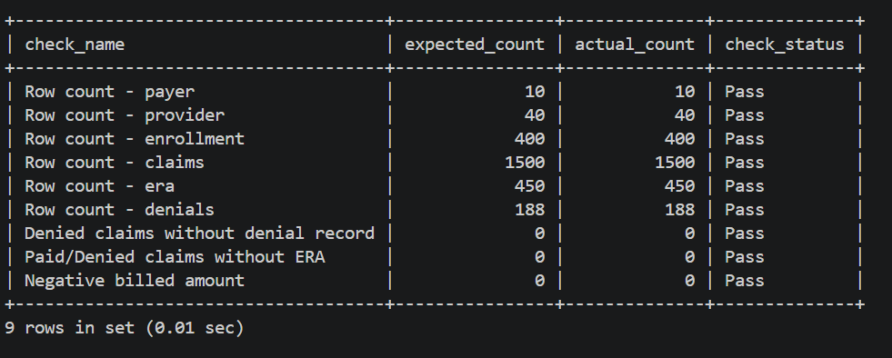
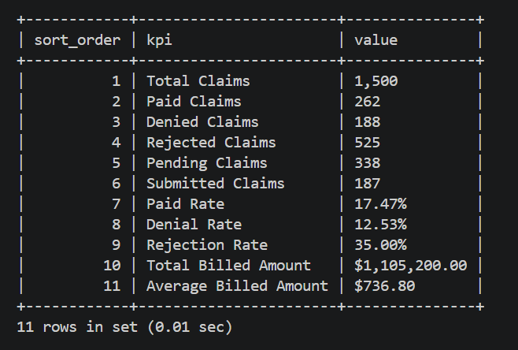
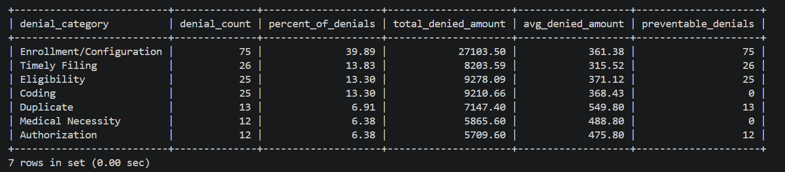
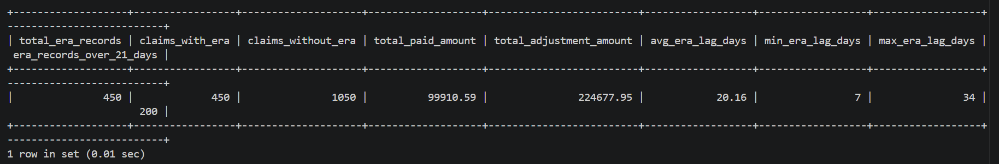
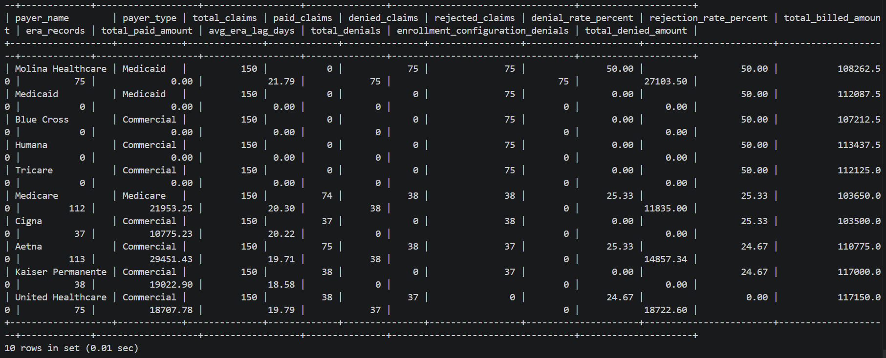
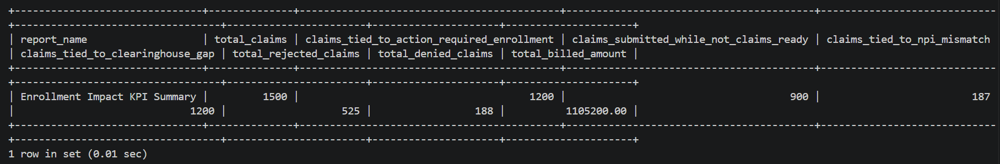
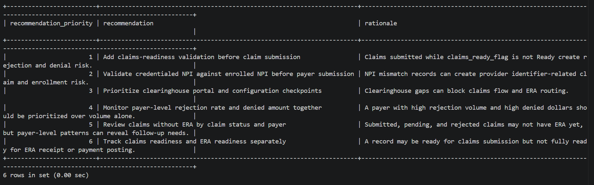

# Healthcare Claims & ERA SQL Analysis

## Project Overview

This project analyzes synthetic healthcare revenue-cycle data using MySQL.

The project focuses on claims, ERA records, denials, payer performance, provider performance, and enrollment readiness. It is designed to show how SQL can be used to identify claim submission issues, denial root causes, ERA/payment lag, payer-level performance gaps, and enrollment-related operational risks.

This project is based on synthetic healthcare data only. No real patient, provider, payer, employer, or production data is included.

---

## Business Problem

Healthcare organizations need visibility into claims, electronic remittance advice, payer performance, denial trends, and enrollment readiness.

Claims and ERA workflows can be disrupted when:

- Claims are submitted before enrollment is ready
- Provider NPI or PTAN information does not match payer setup
- Clearinghouse configuration is incomplete
- Payer ID or routing is incorrect
- ERA readiness is incomplete
- Payer-specific enrollment requirements are missed
- Denials are preventable but not monitored effectively

This SQL project helps identify where those risks appear across claims, ERA, denial, payer, provider, and enrollment data.

---

## Project Objectives

The objective of this project is to answer healthcare revenue-cycle questions using SQL:

1. What are the overall claims, payment, denial, and ERA KPIs?
2. Which payers have the highest rejection or denial rates?
3. Which denial categories are most common and most expensive?
4. Which claims have ERA records and which do not?
5. Which payers have the longest ERA turnaround time?
6. Which enrollment blockers are tied to rejected or denied claims?
7. Which claims were submitted before claims readiness was complete?
8. Which payer, provider, or blocker combinations should operations prioritize?
9. What operational recommendations can be made from the SQL results?

---

## Dataset

The project uses synthetic data generated through SQL scripts.

### Tables

| Table | Grain | Purpose |
|---|---|---|
| `payer` | One row per payer | Stores payer name, payer type, clearinghouse payer ID, and active flag |
| `provider` | One row per provider/practice setup | Stores provider, practice, specialty, NPI, tax ID, and state |
| `enrollment` | One row per provider/payer enrollment setup | Tracks claims enrollment, ERA enrollment, credentialing, NPI match, clearinghouse setup, and readiness |
| `claims` | One row per claim | Stores claim submission, claim status, billed amount, allowed amount, payer, provider, and enrollment relationship |
| `era` | One row per claim-level ERA/remittance record | Stores ERA date, paid amount, adjustment amount, patient responsibility, payment method, and ERA status |
| `denials` | One row per denied claim reason | Stores denial code, denial category, denial reason, denied amount, denial date, and preventable flag |

### Record Counts

| Table | Row Count |
|---|---:|
| `payer` | 10 |
| `provider` | 40 |
| `enrollment` | 400 |
| `claims` | 1,500 |
| `era` | 450 |
| `denials` | 188 |

---

## Tools Used

- MySQL
- MySQL Workbench
- VS Code
- SQL scripts
- Relational database design
- Data quality checks
- SQL joins
- CTEs
- Window functions
- Business-question-driven analysis

---

## SQL Skills Demonstrated

- `CREATE DATABASE`
- `CREATE TABLE`
- Primary keys
- Foreign keys
- `INSERT`
- `SELECT`
- `WHERE`
- `GROUP BY`
- `ORDER BY`
- `CASE`
- `INNER JOIN`
- `LEFT JOIN`
- `LEFT JOIN + IS NULL` audit checks
- CTEs
- Window functions
- `ROW_NUMBER`
- `RANK`
- `DENSE_RANK`
- `SUM() OVER`
- `LAG`
- Date calculations using `DATEDIFF`
- KPI calculations
- Data quality checks
- Business recommendations from SQL output

---

## SQL Script Files

| File | Purpose |
|---|---|
| `01_create_tables.sql` | Creates the MySQL database and relational table structure |
| `02_insert_sample_data.sql` | Loads synthetic payer, provider, enrollment, claims, ERA, and denial data |
| `03_data_quality_checks.sql` | Validates row counts, duplicate IDs, missing relationships, date logic, financial values, and readiness logic |
| `04_basic_select_queries.sql` | Provides beginner-level table exploration and filtering queries |
| `05_claims_kpi_queries.sql` | Calculates core claims KPIs, rates, billed amounts, paid amounts, denial and rejection metrics |
| `06_join_queries.sql` | Joins claims to payer, provider, enrollment, ERA, and denial context |
| `07_denial_analysis.sql` | Analyzes denial root causes, preventable denials, payer denial patterns, and denied amount |
| `08_era_payment_lag_analysis.sql` | Analyzes ERA records, claims without ERA, payment lag, ERA coverage, and payment summary |
| `09_enrollment_claims_analysis.sql` | Connects enrollment readiness to claims, rejections, denials, NPI mismatch, and clearinghouse gaps |
| `10_cte_payer_performance.sql` | Uses CTEs to build payer performance summaries across claims, ERA, denials, and enrollment readiness |
| `11_window_functions.sql` | Uses ranking, running totals, percent-of-total, and Top-N analysis |
| `12_business_questions.sql` | Answers stakeholder-style business questions and provides recommendations |
| `13_portfolio_screenshot_queries.sql` | Contains curated queries used to generate project screenshots |

---

## Key KPIs

### Claims KPIs

| KPI | Value |
|---|---:|
| Total Claims | 1,500 |
| Paid Claims | 262 |
| Denied Claims | 188 |
| Rejected Claims | 525 |
| Pending Claims | 338 |
| Submitted Claims | 187 |
| Paid Rate | 17.47% |
| Denial Rate | 12.53% |
| Rejection Rate | 35.00% |
| Total Billed Amount | $1,105,200.00 |

### ERA KPIs

| KPI | Value |
|---|---:|
| Total ERA Records | 450 |
| Claims with ERA | 450 |
| Claims without ERA | 1,050 |
| Total Paid Amount | $99,910.59 |
| Average ERA Lag | 20.16 days |
| ERA Records Over 21 Days | 200 |

### Denial KPIs

| KPI | Value |
|---|---:|
| Total Denials | 188 |
| Total Denied Amount | $72,518.44 |
| Preventable Denials | 151 |
| Non-Preventable Denials | 37 |
| Enrollment/Configuration Denials | 75 |

### Enrollment Impact KPIs

| KPI | Value |
|---|---:|
| Claims tied to action-required enrollment records | 1,200 |
| Claims submitted while not claims-ready | 900 |
| Claims tied to NPI mismatch | 187 |
| Claims tied to clearinghouse gaps | 1,200 |

---

## Key Findings

### 1. Rejected claims are a major revenue-cycle risk.

Rejected claims account for 525 of 1,500 claims, producing a rejection rate of 35.00%.

Rejected claims represent an early revenue-cycle failure because they may not reach full payer adjudication. This delays payment and ERA flow before denial management can begin.

### 2. Enrollment/Configuration is the largest denial category.

Enrollment/Configuration denials account for 75 of 188 denial records.

This category is connected to payer setup, provider identifiers, NPI/PTAN issues, claims enrollment, ERA enrollment, and clearinghouse configuration.

### 3. Most denials are preventable.

151 of 188 denials are marked preventable.

This suggests that improved front-end validation, payer-specific checklists, and enrollment readiness controls could reduce avoidable denial volume.

### 4. ERA lag should be monitored by payer.

The average ERA lag is 20.16 days, and 200 ERA records are over 21 days.

Delayed ERA receipt can create payment posting delays, manual follow-up, and reduced visibility into claim resolution.

### 5. Enrollment readiness is connected to claim risk.

1,200 claims are tied to action-required enrollment records, and 900 claims were submitted while the enrollment record was not claims-ready.

This supports the need for pre-submission claims readiness validation.

---

## Recommendations

1. Add a claims-readiness validation checkpoint before claim submission.

2. Monitor rejected claims separately from denied claims because rejection is an earlier revenue-cycle failure.

3. Prioritize Enrollment/Configuration denials because they are the largest denial category.

4. Validate credentialed NPI against enrolled NPI before payer submission.

5. Create payer-specific enrollment and clearinghouse setup checklists.

6. Monitor payer-level rejection rate, denial rate, ERA lag, and claims without ERA together.

7. Track claims readiness and ERA readiness separately.

8. Build an operational priority queue based on rejected claims, denied claims, issue billed amount, preventable denials, and enrollment/configuration denial counts.

---

## Screenshots

The screenshots below were generated using the queries in:

`sql_queries/13_portfolio_screenshot_queries.sql`

### Data Quality Checks

This screenshot shows the data validation checks used before analysis, including row counts, missing records, relationship checks, and pass/fail validation.

---

### Claims KPI Summary

This screenshot shows the core claims KPIs, including total claims, paid claims, denied claims, rejected claims, paid rate, denial rate, rejection rate, and total billed amount.

---

### Denial Category Analysis

This screenshot summarizes denial categories by count, percentage of total denials, denied amount, average denied amount, and preventable denial count.

---

### ERA Payment Lag Summary

This screenshot shows ERA volume, claims with ERA, claims without ERA, total paid amount, total adjustment amount, average ERA lag, and ERA records over 21 days.

---

### Payer Performance Summary

This screenshot combines payer-level claims, ERA, denial, payment, and performance metrics using SQL CTEs.

---

### Enrollment Impact Summary

This screenshot shows how enrollment readiness connects to claims risk, including claims tied to action-required enrollment records, claims submitted while not claims-ready, NPI mismatch, and clearinghouse gaps.

---

### Business Recommendations

This screenshot converts SQL findings into operational recommendations for claims readiness, NPI validation, clearinghouse checkpoints, payer monitoring, and ERA readiness tracking.

---

## How to Reproduce This Project

Run the SQL scripts in the following order:

1. `sql_queries/01_create_tables.sql`
2. `sql_queries/02_insert_sample_data.sql`
3. `sql_queries/03_data_quality_checks.sql`
4. `sql_queries/04_basic_select_queries.sql`
5. `sql_queries/05_claims_kpi_queries.sql`
6. `sql_queries/06_join_queries.sql`
7. `sql_queries/07_denial_analysis.sql`
8. `sql_queries/08_era_payment_lag_analysis.sql`
9. `sql_queries/09_enrollment_claims_analysis.sql`
10. `sql_queries/10_cte_payer_performance.sql`
11. `sql_queries/11_window_functions.sql`
12. `sql_queries/12_business_questions.sql`
13. `sql_queries/13_portfolio_screenshot_queries.sql`

The first script creates the MySQL database and tables.  
The second script loads the synthetic data.  
The remaining scripts validate the data, calculate KPIs, perform analysis, and generate screenshot-ready outputs.

---

## Assumptions

- This project uses synthetic data only.
- No real patient, provider, payer, employer, or production data is included.
- One claim may have zero or one ERA record in this synthetic dataset.
- Paid and denied claims are expected to have ERA records.
- Submitted, pending, and rejected claims may not have ERA records.
- Claims readiness and ERA readiness are tracked separately.
- Rejected claims represent claims that failed before successful payer adjudication.
- Denied claims represent claims that were processed but not paid due to a denial reason.
- The operational priority scores are custom portfolio models and would need stakeholder validation in a real business setting.

---

## Limitations

- The dataset is synthetic and does not represent actual payer, provider, patient, employer, or production data.
- The analysis focuses on claims, ERA, denials, payer/provider context, and enrollment readiness.
- The dataset does not include claim line-level details such as CPT codes, diagnosis codes, modifiers, or charge lines.
- The dataset does not include AR aging, payment posting, appeals, or patient balance data.
- Financial values are for demonstration only.
- Payer performance and operational priority scores are simplified portfolio models.
- The project is intended to demonstrate SQL analytics skills, not to represent actual healthcare organization performance.

---

## Future Improvements

Possible future improvements include:

- Add claim line-level data with CPT, diagnosis, modifier, and charge-line details.
- Add AR aging and payment posting data.
- Add eligibility transaction data such as 270/271.
- Add claim status transaction data such as 276/277.
- Add monthly payer trend analysis.
- Add provider/practice drilldowns.
- Build a Power BI dashboard using the same SQL dataset.
- Automate data extraction and cleaning using Python.
- Add payer-specific SLA tracking.
- Add denial appeal and recovery outcomes.

---

## Portfolio Summary

Built a MySQL-based healthcare claims and ERA analysis project using synthetic claims, remittance, denial, payer, provider, and enrollment data.

This project demonstrates SQL database design, data quality checks, joins, KPI calculations, denial analysis, ERA/payment lag analysis, payer performance reporting, enrollment impact analysis, CTEs, window functions, and business-question-driven SQL analysis.

The project connects directly to healthcare EDI and revenue-cycle workflows by analyzing how payer setup, claims enrollment, ERA readiness, NPI/PTAN issues, clearinghouse configuration, and enrollment blockers can affect claim outcomes and remittance flow.