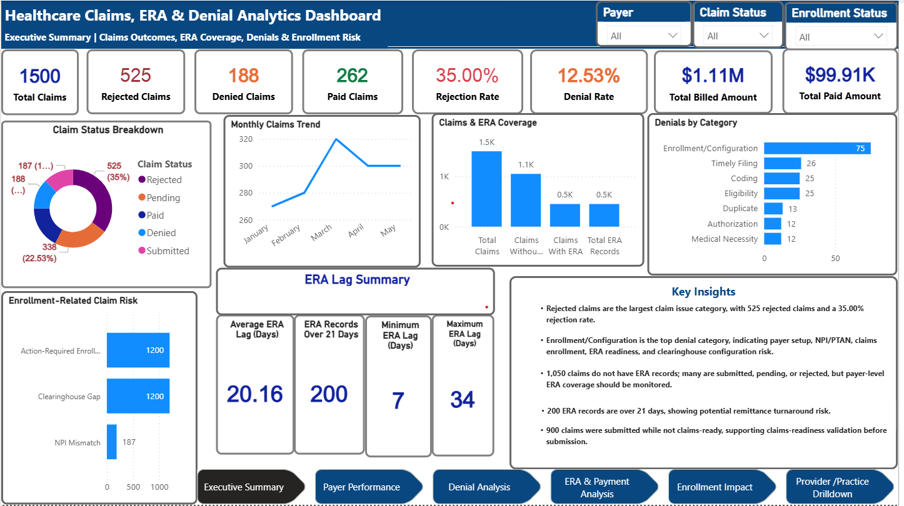
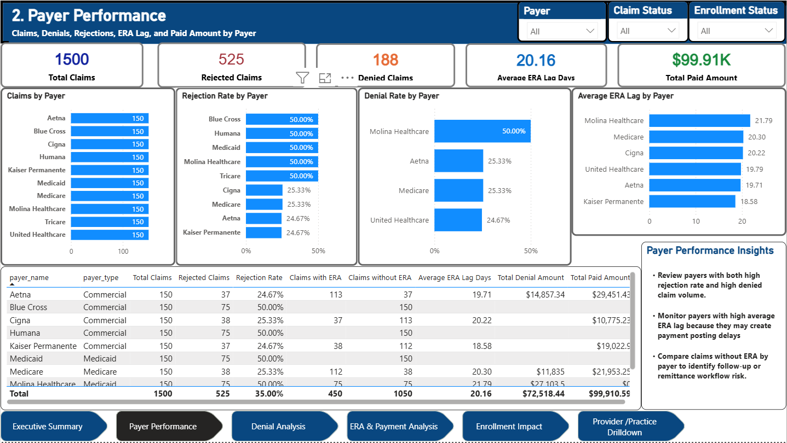
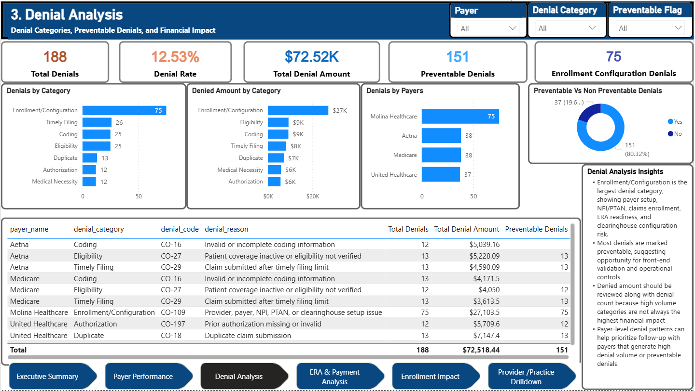
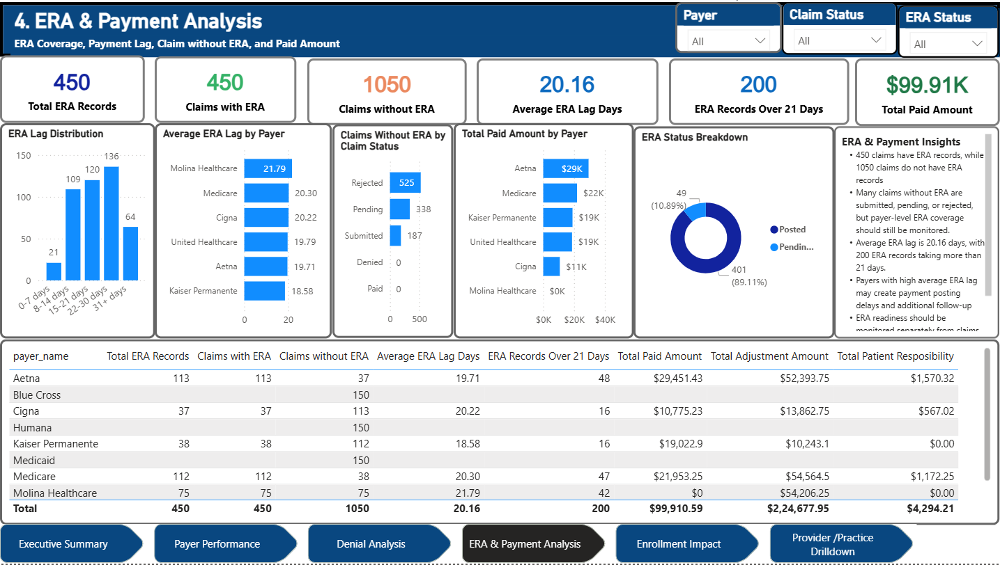
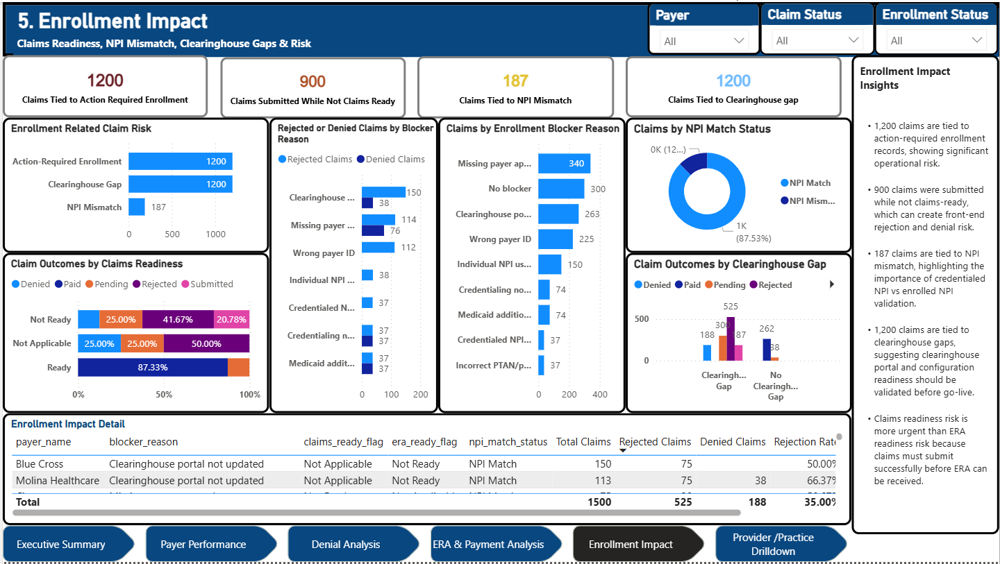
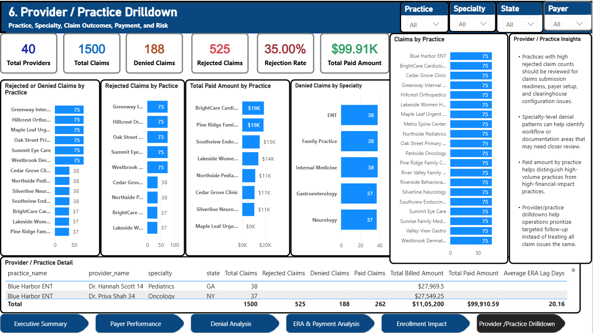

# Healthcare Claims, ERA & Denial Analytics Dashboard

## Project Overview

This project is a Power BI dashboard built to analyze synthetic healthcare revenue-cycle data across claims, ERA records, denials, payer performance, provider performance, and enrollment readiness.

The dashboard helps identify claim rejection risk, denial root causes, ERA/payment lag, payer-level performance issues, and enrollment-related operational risk.

This project uses synthetic data only. No real patient, provider, payer, employer, practice, or production data is included.

---

## Business Problem

Healthcare revenue-cycle and EDI operations teams need visibility into claim outcomes, payer performance, denial categories, ERA/payment lag, claims without ERA, and enrollment/configuration-related claim risk.

Claims and ERA workflows can be disrupted when:

- Claims are submitted before enrollment is ready
- Provider NPI or PTAN information does not match payer setup
- Clearinghouse configuration is incomplete
- Payer ID or routing is incorrect
- ERA readiness is incomplete
- Payer-specific enrollment requirements are missed
- Denials are preventable but not monitored effectively

This dashboard helps monitor these risks through interactive visuals and KPIs.

---

## Dashboard Pages

| Page | Purpose |
|---|---|
| Executive Summary | High-level claims, ERA, denial, financial, and enrollment risk KPIs |
| Payer Performance | Payer-level claim volume, rejection rate, denial rate, ERA lag, and paid amount |
| Denial Analysis | Denial categories, preventable denials, denied amount, and payer denial patterns |
| ERA & Payment Analysis | ERA coverage, claims without ERA, payment lag, paid amount, and ERA status |
| Enrollment Impact | Claims tied to action-required enrollment, NPI mismatch, clearinghouse gaps, and claims readiness risk |
| Provider / Practice Drilldown | Practice, provider, specialty, claim outcomes, payment, and risk drilldown |

---

## Dataset

The dashboard uses CSV exports from a MySQL claims and ERA database.

### Tables

| Table | Description |
|---|---|
| `dim_payer` | Payer details such as payer name, payer type, and clearinghouse payer ID |
| `dim_provider` | Provider and practice details such as provider name, practice name, specialty, and state |
| `dim_enrollment` | Provider/payer enrollment readiness, claims readiness, ERA readiness, NPI match, blocker reason, and clearinghouse setup |
| `fact_claims` | Claim-level data including claim status, billed amount, allowed amount, claim source, payer, provider, and enrollment ID |
| `fact_era` | ERA/remittance data including paid amount, adjustment amount, patient responsibility, ERA status, and ERA lag |
| `fact_denials` | Denial data including denial category, denial reason, denied amount, denial code, and preventable flag |

### Record Counts

| Table | Row Count |
|---|---:|
| Payers | 10 |
| Providers | 40 |
| Enrollment Records | 400 |
| Claims | 1,500 |
| ERA Records | 450 |
| Denial Records | 188 |

---

## Tools Used

- Power BI Desktop
- Power Query
- DAX
- MySQL
- MySQL Workbench
- VS Code
- CSV exports
- GitHub

---

## Power BI Skills Demonstrated

- Data import from CSV exports
- Power Query data type cleanup
- Data modeling with fact and dimension tables
- Relationship design
- DAX measures
- Calculated columns
- KPI cards
- Slicers
- Multi-page report design
- Drilldown-style analysis
- Dashboard navigation
- Data storytelling
- Healthcare revenue-cycle KPI reporting

---

## Key Measures

Examples of DAX measures used in the report:

- Total Claims
- Paid Claims
- Denied Claims
- Rejected Claims
- Rejection Rate
- Denial Rate
- Total Billed Amount
- Total Paid Amount
- Claims With ERA
- Claims Without ERA
- Average ERA Lag Days
- ERA Records Over 21 Days
- Total Denials
- Preventable Denials
- Enrollment Configuration Denials
- Claims Submitted While Not Claims Ready
- Claims Tied to NPI Mismatch
- Claims Tied to Clearinghouse Gap

---

## Key KPIs

| KPI | Value |
|---|---:|
| Total Claims | 1,500 |
| Paid Claims | 262 |
| Denied Claims | 188 |
| Rejected Claims | 525 |
| Rejection Rate | 35.00% |
| Denial Rate | 12.53% |
| Total Billed Amount | $1,105,200.00 |
| Total Paid Amount | $99,910.59 |
| Total ERA Records | 450 |
| Claims Without ERA | 1,050 |
| Average ERA Lag | 20.16 days |
| ERA Records Over 21 Days | 200 |
| Total Denials | 188 |
| Preventable Denials | 151 |
| Enrollment/Configuration Denials | 75 |
| Claims Submitted While Not Claims-Ready | 900 |

---

## Key Findings

1. Rejected claims are the largest claim issue category, with 525 rejected claims and a 35.00% rejection rate.

2. Enrollment/Configuration is the largest denial category, indicating payer setup, NPI/PTAN, claims enrollment, ERA readiness, and clearinghouse configuration risk.

3. 1,050 claims do not have ERA records. Many of these claims are submitted, pending, or rejected, but payer-level ERA coverage should still be monitored.

4. Average ERA lag is 20.16 days, and 200 ERA records are over 21 days.

5. 900 claims were submitted while not claims-ready, supporting the need for claims-readiness validation before submission.

6. 1,200 claims are tied to action-required enrollment records, showing significant operational risk.

7. 187 claims are tied to NPI mismatch, highlighting the importance of credentialed NPI vs enrolled NPI validation.

8. 1,200 claims are tied to clearinghouse gaps, suggesting clearinghouse portal and configuration readiness should be validated before go-live.

---

## Recommendations

1. Add claims-readiness validation before claim submission.

2. Monitor rejected claims separately from denied claims because rejection is an earlier revenue-cycle failure.

3. Prioritize Enrollment/Configuration denials because they are the largest denial category.

4. Validate credentialed NPI against enrolled NPI before payer submission.

5. Create payer-specific enrollment and clearinghouse setup checklists.

6. Monitor payer-level rejection rate, denial rate, ERA lag, and claims without ERA together.

7. Track claims readiness and ERA readiness separately.

8. Use provider/practice drilldowns to prioritize targeted operational follow-up.

---

## Screenshots

### Executive Summary

This page provides a high-level view of claim volume, rejected claims, denied claims, paid claims, rejection rate, denial rate, billed amount, paid amount, ERA coverage, denial categories, and enrollment-related claim risk.

---

### Payer Performance

This page compares payers by claim volume, rejected claims, denied claims, rejection rate, denial rate, average ERA lag, claims with ERA, claims without ERA, and total paid amount.

---

### Denial Analysis

This page analyzes denial categories, denied amount, preventable denials, payer-level denial patterns, and denial detail.

---

### ERA & Payment Analysis

This page analyzes ERA records, claims with ERA, claims without ERA, ERA lag distribution, average ERA lag by payer, ERA status, and total paid amount by payer.

---

### Enrollment Impact

This page shows how enrollment readiness, claims readiness, NPI mismatch, clearinghouse gaps, and blocker reasons are connected to claim outcomes and financial risk.

---

### Provider / Practice Drilldown

This page provides a drilldown view by practice, provider, specialty, state, rejected claims, denied claims, paid amount, and ERA lag.`

---

## How to Refresh the Dashboard

The current dashboard uses CSV exports from MySQL.

To refresh the dashboard:

1. Export updated CSV files from MySQL.
2. Save them with the same file names in `data/raw_exports/`.
3. Open the Power BI file.
4. Click `Home → Refresh`.
5. Validate row counts and dashboard KPIs.
6. Review static insight text if KPI values change.

Future improvement: connect Power BI directly to MySQL instead of using CSV exports.

---

## Assumptions

- This project uses synthetic data only.
- No real patient, provider, payer, employer, practice, or production data is included.
- One claim may have zero or one ERA record in this synthetic dataset.
- Paid and denied claims are expected to have ERA records.
- Submitted, pending, and rejected claims may not have ERA records.
- Claims readiness and ERA readiness are tracked separately.
- Rejected claims represent claims that failed before successful payer adjudication.
- Denied claims represent claims that were processed but not paid due to a denial reason.

---

## Limitations

- The dataset is synthetic and does not represent actual payer, provider, patient, employer, or production data.
- The dashboard focuses on claims, ERA, denials, payer/provider context, and enrollment readiness.
- The dataset does not include claim line-level CPT, ICD, HCPCS, diagnosis, modifier, or charge-line details.
- The dataset does not include AR aging, appeals, payment posting, or patient balance data.
- Financial values are for demonstration only.
- Static insight text should be reviewed if the data is refreshed with new records.

---

## Future Improvements

Possible improvements include:

- Connect Power BI directly to MySQL instead of using CSV exports.
- Add claim line-level data with CPT, ICD, HCPCS, modifiers, and charge-line details.
- Add AR aging and payment posting data.
- Add eligibility transaction data such as 270/271.
- Add claim status transaction data such as 276/277.
- Add payer-specific SLA tracking.
- Add dynamic insight cards using DAX.
- Add drillthrough pages for payer and provider detail.
- Build a published Power BI Service version with scheduled refresh.

---

## Portfolio Summary

Built a Power BI healthcare claims, ERA, and denial analytics dashboard using synthetic revenue-cycle data.

The dashboard analyzes claim outcomes, rejection rate, denial rate, denial categories, ERA coverage, ERA lag, payer performance, provider/practice performance, and enrollment-related operational risk.

This project demonstrates Power BI data modeling, DAX measures, KPI design, slicers, multi-page dashboard design, healthcare revenue-cycle analytics, and business insight communication.